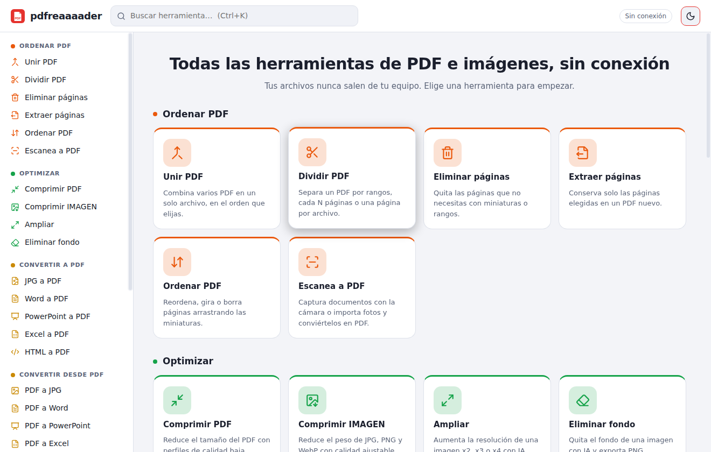
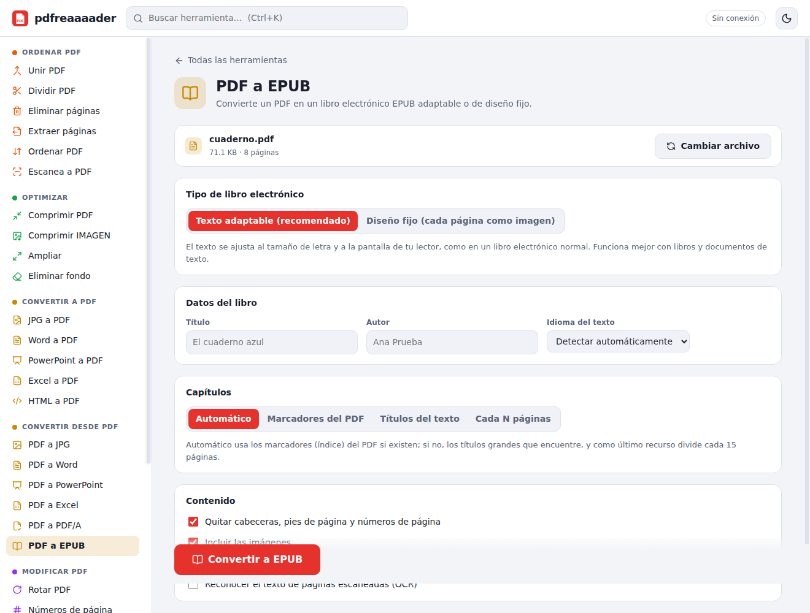
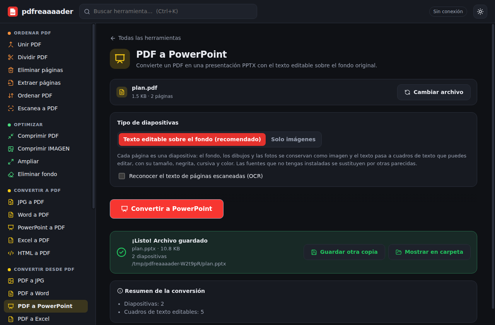

# pdfreaaaader

Aplicación de escritorio para **Windows** (instalador `.exe` y versión portable), **100 % sin conexión** y **en español**,
con el catálogo de herramientas de iLovePDF / iLoveIMG más una herramienta propia: **PDF a EPUB**.

Electron + Vite + React + TypeScript. Tema claro y oscuro (se recuerda la elección). El plan original está en [PLAN.md](PLAN.md).



## Herramientas

| Categoría | Herramienta | Motor |
|---|---|---|
| **Ordenar PDF** | Unir · Dividir · Eliminar páginas · Extraer páginas · Ordenar PDF | `pdf-lib`, miniaturas con `pdf.js`, arrastrar con `@dnd-kit` |
| | Escanea a PDF | cámara (`getUserMedia`) o fotos; filtros Color / Grises / Documento / B&N; `pdf-lib` |
| **Optimizar** | Comprimir PDF | Ghostscript (perfiles máxima / recomendada / menos compresión) |
| | Comprimir IMAGEN | `sharp` (mozjpeg, WebP, PNG con paleta) con tabla antes/después |
| | Ampliar | Real-ESRGAN ncnn-vulkan (×2, ×3, ×4) |
| | Eliminar fondo | ISNet (`onnxruntime-node`) → PNG transparente |
| **Convertir a PDF** | JPG a PDF | `pdf-lib` (orientación, tamaño, márgenes, EXIF) |
| | Word / PowerPoint / Excel a PDF | **motores propios** (`.docx`, `.pptx`, `.xlsx`, CSV → HTML) + Chromium de Electron imprime el PDF |
| | HTML a PDF | ventana oculta de Electron + `printToPDF` (URL, archivo o código pegado) |
| **Convertir desde PDF** | PDF a JPG | `pdf.js` → canvas (DPI configurable, JPG o PNG) → ZIP |
| | PDF a Word / PowerPoint | **motores propios**: maquetación del PDF → escritores de `.docx` y `.pptx` |
| | PDF a Excel | **extracción de tablas propia** (ver más abajo) |
| | PDF a PDF/A | Ghostscript (PDF/A-2b con perfil sRGB) |
| | **PDF a EPUB** | motor propio en JavaScript (ver más abajo) |
| **Modificar PDF** | Rotar PDF · Números de página | `pdf-lib` (el número queda derecho aunque la página esté girada) |
| **Seguridad de PDF** | Desbloquear PDF | `qpdf` compilado a WebAssembly (funciona sin conexión): quita la contraseña de apertura —si la conoces— y las restricciones de imprimir, copiar o editar (RC4 y AES de 128/256 bits). No adivina contraseñas |
| **Imágenes** | Redimensionar · Recortar · Girar | `sharp`; recorte con selector visual (`react-image-crop`) |
| | JPG a PNG · PNG a JPG (con color de fondo para la transparencia y calidad) · Convertir a JPG / desde JPG (WebP, GIF, BMP, TIFF, SVG…) · HTML a IMAGEN | `sharp`; captura de página completa por trozos con el depurador de Chromium |

> **Vista previa al eliminar/extraer páginas:** cada miniatura tiene una lupa que abre la página en grande en una ventana emergente (con flechas ← → para recorrerlas, botón para marcarla o desmarcarla y Esc para cerrar). «Revisar selección» recorre solo las páginas elegidas y, si activas «Ver la página en grande al hacer clic en una miniatura», el clic abre directamente esa ventana. Ver `docs/capturas/vista-previa-eliminar.png`.

Todo se procesa en el equipo. Solo «HTML a PDF/IMAGEN» con una dirección web necesita internet, por razones obvias.

## PDF a EPUB

Todo en JavaScript, sin dependencias externas (`src/lib/epub/`):

1. **Extracción** con `pdfjs-dist`: texto con posición, tamaño y estilo (negrita/cursiva por el nombre real de la fuente), y posición de las imágenes.
2. **Maquetación**: líneas → párrafos (espacio entre párrafos, sangría o línea corta, según lo que use el documento), guiones de fin de línea, listas con viñetas y numeradas, títulos `h1–h3` por tamaño relativo al cuerpo, **dos columnas** (también en páginas mixtas, con el título a ancho completo) y párrafos que cruzan página o columna.
3. **Cabeceras, pies y números de página** repetidos se eliminan (detección por repetición + aislamiento + formato de número).
4. **Capítulos**: marcadores (outline) del PDF → títulos detectados → cada N páginas. El índice tiene un segundo nivel con los subtítulos.
5. **Imágenes**: se recortan de la página renderizada (sirve también para gráficos vectoriales); se descartan logotipos repetidos, iconos y fondos.
6. **Empaquetado** con `jszip` (`mimetype` primero y sin comprimir): `container.xml`, `content.opf` (EPUB 3 + NCX), `nav.xhtml`, capítulos XHTML, CSS, portada (primera página) y metadatos editables (título, autor, idioma detectado).
7. Dos modos: **texto adaptable** (por defecto) y **diseño fijo** (`pre-paginated`, cada página como imagen).
8. **OCR sin conexión** (`tesseract.js` con el núcleo y los datos de español e inglés incluidos) para PDF escaneados; apagado por defecto y solo para páginas sin texto.



Validado con **epubcheck 5.2.1 (0 errores, 0 avisos)** sobre libros generados con LibreOffice (justificados y sin justificar, con y sin marcadores,
cabecera, pie, columnas, listas e imagen), el modo de diseño fijo, un PDF escaneado y un PDF sin estructura.

### Límites conocidos
- Los PDF con **tablas, columnas irregulares o más de dos columnas** se reconstruyen de forma aproximada; para esos usa el modo de diseño fijo.
- En texto sin justificar y sin sangría, un párrafo que continúa en la página siguiente puede quedar partido si la página acaba justo al final de una frase.
- El OCR comete errores y es lento (unos segundos por página).

## Word, Excel y PowerPoint a PDF

Sin LibreOffice ni Office: cada documento se lee por código (`src/lib/office/`) y se convierte en un HTML autocontenido con las reglas de página en CSS
(`@page`); Chromium, que ya viene con Electron, lo imprime a PDF.

| Formato | Qué se conserva |
|---|---|
| **Word** (`.docx`, `.docm`, `.dotx`) | estilos con herencia (`basedOn`, valores por defecto), formato de texto, listas con niveles y reinicios, tablas (celdas combinadas, bordes, sombreado, estilos de tabla con filas alternas), imágenes (con recorte), tabuladores con puntos de relleno, secciones con página apaisada o columnas, encabezados y pies con número de página, notas al pie, enlaces |
| **Excel** (`.xlsx`, `.xlsm`, CSV) | formatos de número, fecha y moneda (`#,##0.00 "€"`, `dd/mm/yyyy`, `0,0%`, colores `[Red]`), estilos de celda, celdas combinadas, anchos y alturas, filas/columnas ocultas, área de impresión y repetición de títulos, **gráficos e imágenes** colocados sobre las celdas donde están anclados; las hojas muy anchas se reparten en bandas de columnas |
| **PowerPoint** (`.pptx`, `.ppsx`) | una página por diapositiva con el tamaño de la presentación: textos con herencia del patrón (viñetas, numeración, tamaños), formas (rectángulos, elipses, flechas, formas libres) en SVG con relleno, degradado y contorno, imágenes con recorte, tablas con estilo, gráficos, grupos, fondos |

El HTML intermedio no puede cargar nada de fuera (política de contenido `default-src 'none'`), no lleva scripts y escapa todo el texto del documento.

### Límites conocidos
- No se leen los formatos antiguos (`.doc`, `.xls`, `.ppt`), RTF ni OpenDocument: la app explica cómo guardarlos como `.docx`, `.xlsx` o `.pptx`.
- Los **gráficos** (Excel, Word, PowerPoint) se dibujan a partir de los datos que guarda el archivo: columnas, barras, líneas, áreas, sectores, anillos y dispersión, con título, ejes, leyenda y
  etiquetas de datos (incluidos los de librerías que no guardan los datos en el gráfico, que se leen de las celdas). Los demás tipos (radar, burbujas, cotizaciones…), los ejes secundarios,
  los objetos SmartArt y las imágenes EMF/WMF se sustituyen por un recuadro y se avisa.
- Las **fórmulas** de Excel se muestran con el último valor que guardó Excel. Si el libro no lo trae (lo crean librerías como openpyxl o XlsxWriter) o pide recalcular al abrir, la app las calcula con un evaluador propio: operadores, referencias y rangos (también entre hojas), fórmulas compartidas y las funciones más usadas (SUMA, PROMEDIO, MIN, MAX, SI, Y, O, SI.ERROR, REDONDEAR, SUMAR.SI, CONTAR.SI, MAYUSC, IZQUIERDA, EXTRAE…, en español o inglés; sin BUSCARV ni funciones de fecha por ahora). Una función no admitida conserva el valor guardado o, si no hay, aparece `#NAME?` con un aviso.
- La paginación puede diferir de la de Word en algún salto de página, y las fuentes que no estén instaladas se sustituyen por otras parecidas.

## PDF a Word y PDF a PowerPoint

También por código y sin programas externos:

- **PDF a Word** reutiliza la maquetación de PDF a EPUB (párrafos, títulos, listas, columnas, imágenes, OCR opcional) y añade la **detección de tablas** (la misma de PDF a Excel):
  escribe un `.docx` con estilos de título, negrita y cursiva, listas numeradas que reinician, tablas con cabecera repetida e imágenes. El texto fluye como en cualquier documento de Word.
- **PDF a PowerPoint** genera una diapositiva por página con el **fondo original sin el texto** (se dibuja la página omitiendo las operaciones de texto) y, encima, **cuadros de texto
  editables** con el tamaño, la negrita, la cursiva, la fuente y el **color** reales (el color se averigua comparando la página con y sin texto). Con «Solo imágenes» cada
  diapositiva es la página entera como imagen.



Los `.docx` y `.pptx` generados se validan en las pruebas abriéndolos con LibreOffice (si está instalado en la máquina de desarrollo) y volviéndolos a leer con los motores de arriba.

## PDF a Excel

La herramienta usa un extractor propio (`src/lib/tablas/`): agrupa el texto en filas, detecta bloques
con celdas alineadas en columnas, une las tablas que continúan en la página siguiente (omitiendo la cabecera repetida), reconoce celdas combinadas y convierte los números
(`1.234,50`, `12 %`, `(300)`) en números de Excel. Genera cada tabla en su hoja y, opcionalmente, el resto del texto en una hoja «Texto». El `.xlsx` se escribe a mano y se
comprueba en las pruebas abriéndolo con LibreOffice (si está instalado).

## Desarrollo

Requisitos: Node 22 o superior.

```bash
npm install
npm run dev          # Vite + Electron con recarga
npm run typecheck
npm test             # vitest: lib/pdf, lib/epub, lib/office, lib/tablas, sharp, Ghostscript, OCR, IA
npm run build        # interfaz + proceso principal
npx playwright test  # pruebas de extremo a extremo con Electron (en Linux: xvfb-run -a npx playwright test)
```

El renderer **no usa `file://`**: la versión empaquetada se sirve por un esquema propio `app://` para que funcionen `fetch`, workers y wasm
(pdf.js, Tesseract, onnxruntime) como en un sitio normal. Los recursos de pdf.js y de OCR se copian a `public/` con `scripts/copiar-recursos.mjs`.

## Compilar el instalador (Windows)

```powershell
npm install
npm run fetch-binaries   # descarga Ghostscript, Real-ESRGAN y el modelo a .\resources (≈ 300 MB)
npm run dist             # release\pdfreaaaader-Setup-<versión>.exe y release\pdfreaaaader-Portable-<versión>.exe
```

`npm run fetch-binaries -- -Solo modelo,realesrgan` descarga solo una parte. Si no los descargas, la app funciona igual y cada herramienta
que dependa de un programa que falte lo avisa en pantalla (también detecta Ghostscript instalado en `C:\Program Files`, `gs` en el `PATH` y las variables
`PDFREAAAADER_GS`, `PDFREAAAADER_MODELO_FONDO`). `npm run dist:dir` genera solo la carpeta sin instalador (más rápido para probar).

Tamaño del instalador: **≈ 420 MB** (modelo ≈ 170 MB, Electron ≈ 100 MB, Ghostscript ≈ 65 MB, Real-ESRGAN ≈ 50 MB). Word, Excel y PowerPoint no añaden nada: usan el Chromium de Electron.
Si es demasiado, el modelo de «Eliminar fondo» y Real-ESRGAN se pueden pasar a una descarga en el primer uso.

Si `npm run dist` falla con «Cannot create symbolic link» (al extraer winCodeSign), abre PowerShell como administrador o activa el **Modo desarrollador** de Windows
(Configuración → Privacidad y seguridad → Para programadores); es un requisito de electron-builder, no de la app.

El repositorio incluye un flujo de GitHub Actions (`.github/workflows/windows.yml`) que ejecuta todo esto en un Windows limpio y sube el instalador como artefacto.

## Estructura

```
electron/         main.ts, preload.ts, ipc/ (archivos, imagen, html, externos, ia), lib/ (sharp, Ghostscript, IA)
src/
  app/            App, Layout, tema
  pages/          Home, ToolPage
  tools/          registry.ts (una entrada por herramienta) + una carpeta por herramienta + comun/ (vistas compartidas)
  lib/pdf/        unir, dividir, rotar, números, imágenes a PDF, rangos, zip
  lib/epub/       extraer, layout, capítulos, xhtml, ensamblar, ocr, renderNavegador, lectura (compartida con Word/PowerPoint)
  lib/office/     xml, docx/xlsx/pptx → HTML, escritores de .docx y .pptx, PDF → Word/PowerPoint
  lib/tablas/     detectar, números, xlsx
  components/     FileDropzone, Miniatura, ListaOrdenable, CuadriculaOrdenable, SelectorPaginas, ResultadoPanel…
scripts/          build-electron.mjs, dev.mjs, copiar-recursos.mjs, generar-iconos.mjs, fetch-binaries.ps1
tests/            vitest (unitarias e integración) y tests/e2e (Playwright para Electron)
resources/        programas externos (no se versiona)
```

Añadir una herramienta es una entrada en `src/tools/registry.ts` (id, categoría, nombre, descripción, icono y componente); de ahí salen la home, el menú lateral y el buscador.

## Pruebas con archivos de Office

`tests/fixtures/office/` guarda un `.docx`, un `.xlsx` y un `.pptx` creados con `python-docx`, `openpyxl` y `python-pptx` (`python3 tests/fixtures/generar-office.py` los regenera): son documentos
escritos por programas ajenos a esta app, así que sirven de entrada real. Algunas pruebas usan LibreOffice si está instalado, solo como generador de PDF de ejemplo y para
comprobar que los `.docx`/`.pptx` generados se abren; la app no lo necesita.

## Licencias

- **Ghostscript** es AGPL. Para uso personal no hay problema; si algún día distribuyes la app, revisa esa licencia (o sustituye la compresión por otra herramienta).
- **Real-ESRGAN** (BSD-3) y **tesseract.js** (Apache-2.0) son compatibles con la redistribución. Revisa la licencia del modelo **ISNet** antes de distribuir.
- Los iconos son propios (SVG con `lucide-react`); no se usa ningún recurso gráfico de iLovePDF.
